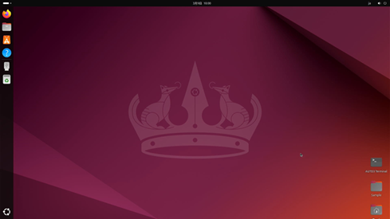

# 3. 起動方法

PC本体の電源ボタンを押して起動させます。  

起動後は下記のUbuntu画面がモニタに表示されます。  




出荷時はユーザログイン操作は省略させる設定となっています。  
再ログイン等でユーザ/パスワードの入力を求められた場合は、下記を入力してください。  

```
    ユーザ名　：aiplay  
    パスワード：0  
```
上記は出荷時の初期パスワードとなります。
必要に応じてユーザ側で変更してください。

