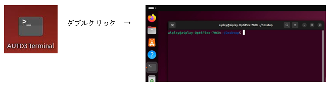

## 4.2 実行方法
サンプルプログラムの動作は、AUTD3用のPython仮想環境下で行う必要があります。

デスクトップ上のアイコン「AUTD Termnal」を開く(ダブルクリック)ことにより、
サンプルを実行できる環境のターミナル（コンソール画面）が表示されます。



<br>
Pythonプログラムの実行は下記コマンドにて行います。  

``` sh
　　python3 ファイル名
```
```
　　例）サンプル１(sample01_single.py)を実行する場合
　　　python3 PythonSample/sample01_single.py

       サンプルプログラムはPythonSampleディレクトリ下にありますので、
       ディレクトリ名を指定する必要があります。
```


「AUTD3 Terminal」では、初期カレントディレクトリがデスクトップとなります。
この為、サンプルプログラムを実行する際は、
デスクトップ(/home/aiplay/Desktop)からの相対パス等で指定する必要があります。

標準のターミナル(デスクトップ右クリックメニューから「端末で開く」をクリック、あるいは、
Ctrl+Alt+T等）でターミナルを開いた場合は、下記コマンドで実行環境に切り替える必要があります。
``` sh
　　source ~/autd3env/bin/activate
```

なお標準ターミナルでは、カレントディレクトリがホーム(/home/aiplay)となっていますので、
サンプルプログラムのパス指定にはデスクトップを含める様にしてください。
``` 
　　　　例）python3 ~/Desktop/Sample/sample01_single.py
```
