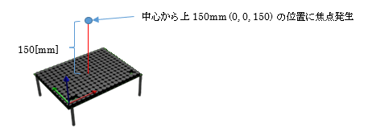
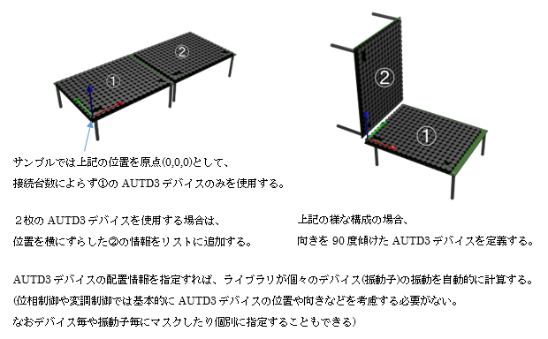
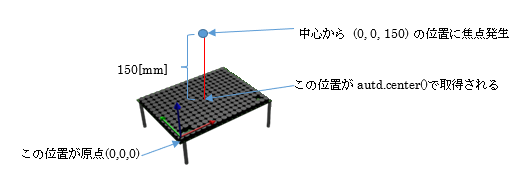

## 5.2 単一焦点サンプル(sample01_single.py)

### 動作概要
このサンプルは、１枚のAUTD3デバイスの中央上部(デバイス表面から15cm上)に
触覚を感じる焦点を発生させます。




コンソールより下記コマンドを入力することで実行できます。

``` sh
python3 PythonSample/sample01_single.py
```

Enterキーを押すと終了します。


### コード説明

コード全体を下記に示します。

``` python
import numpy as np      # 科学技術用パッケージの準備
from pyautd3 import (   # AUTD3パッケージの準備
    AUTD3,                  # 触覚ボードの定義
    Controller,             # 触覚ボード制御
    Focus,                  # 単一焦点を生成するGain
    FocusOption,            # 単一焦点用オプション
    Silencer,               # 可聴音抑止
    Sine,                   # 正弦波
    SineOption,             # 正弦波オプション
    Hz,                     # 周波数指定
)
from pyautd3_link_ethercrab import EtherCrab, EtherCrabOption, Status # EtherCrab用パッケージの準備
 
# デバイスエラー発生時の処理
def err_handler(idx: int, status: Status) -> None:
    # エラー内容の表示
    print( f"Device[{idx}]: {status}" ) 
 
 
# デモ開始
print( "<単一焦点デモ>" )
 
# デバイスへの接続(EtherCrabを使用)
autd = Controller.open(
            [ # AUTD3ボードの指定
                AUTD3(pos=[0.0, 0.0, 0.0], rot=[1, 0, 0, 0]) # １枚目のボードの位置と向き
            ],
            EtherCrab( # EtherCrabでの接続
                err_handler=err_handler, # エラー発生時の処理関数指定
                option=EtherCrabOption() # デフォルトオプション
            ) 
        )
 
# 可聴音を抑えるための指示
autd.send( Silencer() )
 
# 動作指定
g = Focus( # 単一焦点の位相制御
        pos=autd.center() + np.array( [0.0, 0.0, 150.0] ), # 中心から上に150mmの位置
        option=FocusOption(), # デフォルトオプション
    )
m = Sine( # Sin振幅
        freq=150 * Hz, # 150Hz
        option=SineOption(), # デフォルトオプション
    )
print( "動作開始" )
autd.send( (m,g) ) # 位相制御と変調制御を指示
 
# キー入力待ち(終了指示待ち)
print( "Enterキー入力で終了" )
_= input()
 
# デバイスへの接続終了
autd.close()
```

<br>

コードの詳細について説明します。  
``` python
import numpy as np      # 科学技術用パッケージの準備
from pyautd3 import (   # AUTD3パッケージの準備
    AUTD3,                  # 触覚ボードの定義
    Controller,             # 触覚ボード制御
    Focus,                  # 単一焦点を生成するGain
    FocusOption,            # 単一焦点用オプション
    Silencer,               # 可聴音抑止
    Sine,                   # 正弦波
    SineOption,             # 正弦波オプション
    Hz,                     # 周波数指定
)
from pyautd3_link_ethercrab import EtherCrab, EtherCrabOption, Status # EtherCrab用パッケージの準備
```
  上記では使用するパッケージ及びクラスを宣言しています。
  
| パッケージ |  内容/用途 |
| --- | --- |
| numpy	| 科学学術用パッケージ。array関数を使用する。 |
| pyautd3 | AUTD3デバイス制御パッケージ。impot句以下のクラスを使用する。 |
| pyautd3_link_ethercrab | EtherCrab用パッケージ。impot句以下のクラスを使用する。 |

<br>

``` python
# デバイスエラー発生時の処理
def err_handler(idx: int, status: Status) -> None:
    # エラー内容の表示
    print( f"Device[{idx}]: {status}" ) 
```
EtherCrab接続を行う場合、エラー発生時に呼び出されるエラーハンドラ(関数)を指定する必要があり、上記がその関数定義となります。  
このサンプルのエラーハンドラ(err_handler)では、エラー内容をコンソールに表示しています。  

<br>

``` python
# デバイスへの接続(EtherCrabを使用)
autd = Controller.open(
            [ # AUTD3ボードの指定
                AUTD3(pos=[0.0, 0.0, 0.0], rot=[1, 0, 0, 0]) # １枚目のボードの位置と向き
            ],
            EtherCrab( # EtherCrabでの接続
                err_handler=err_handler, # エラー発生時の処理関数指定
                option=EtherCrabOption() # デフォルトオプション
            ) 
        )
```
デバイスへの接続はControllerクラスのopenメソッドにより行います。  
引数として、AUTD3デバイスのリストと接続に使用するLinkとしてEtherCrabを指定しています。  

本サンプルではAUTD3デバイスを１枚のみ使用しますのでリストは  
&nbsp;&nbsp;&nbsp;&nbsp;基準位置：(0, 0, 0)	原点  
&nbsp;&nbsp;&nbsp;&nbsp;向き　　：(1, 0, 0, 0)	上向き  
の１件のみとなっていますが、  
複数のAUTD3デバイスを使用する場合は、各デバイス毎の位置と方向を列挙します。
  

EtherCrabを用いて接続を行う場合は、先に定義したエラーハンドラとオプションを指定します。  
サンプルではデフォルトのオプション(引数なし)を指定していますが、  
必要によってネットワークインターフェースや同期タイミング等を指定できます。  

<br>

``` python
# 可聴音を抑えるための指示
autd.send( Silencer() )
```
上記では、可聴音を抑制するSilencerを指示しています。  
`Silencer().disable()`を送信すれば、消音処理を無効化できます。  

<br>

``` python
# 動作指定
g = Focus( # 単一焦点の位相制御
        pos=autd.center() + np.array( [0.0, 0.0, 150.0] ), # 中心から上に150mmの位置
        option=FocusOption(), # デフォルトオプション
    )
m = Sine( # Sin振幅
        freq=150 * Hz, # 150Hz
        option=SineOption(), # デフォルトオプション
    )
```
上記で「単一焦点の位相制御Focus」と「正弦波変調Sine」の定義を行っています。  

Focusの引数は「焦点座標(pos)」と「オプション(option)」を指定します。  
「autd.center()」は全AUTD3デバイスの中心位置を表し、  
「np.array( [0.0, 0.0, 150.0] )」を加算することで  
AUTDデバイス中心の上方向150.0[mm]の位置を焦点座標としています。  
  

変調制御として「正弦波:Sine」を指定しています。  
変調なし(Static)の場合、動きがないと触覚を感じられません。  
周波数は「150Hz」を指定していますが、この値を変更すると触覚が変化します。  

<br>

``` python
print( "動作開始" )
autd.send( (m,g) ) # 位相制御と変調制御を指示

# キー入力待ち(終了指示待ち)
print( "Enterキー入力で終了" )
_= input()
```
上記の「send()」にて位相制御と変調制御をAUTD3デバイスに送信し、触覚を発生させます。  

位相制御や変調制御は、送信する毎に上書きされます。（最後に送信された制御が使用されます）  

Focusでは単一位置で固定強度の焦点を発生させます。  
細かく位相を変化させたい場合(焦点位置をブレさせたり、強さを変化させたい場合)などは  
「STM：時空間変調」が有効です。  

送信後はEnterキーが押されるまで待機します。  
（プログラムが終了すると超音波出力も終了するため、キー入力があるまで出力が継続される様にしています）  

<br>

``` python
# デバイスへの接続終了
autd.close()
```
上記の「close()」により、AUTDデバイスとの接続を終了します。  

