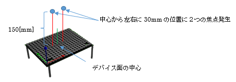
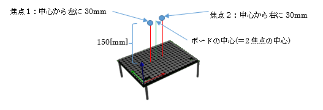

## 5.3 複数焦点サンプル(sample02_multi.py)

### 動作概要
このサンプルは、１枚のAUTD3デバイスの上に2つの触覚を感じる焦点を発生させます。




多焦点生成アルゴリズムとして「GSPAT:Gershberg-Saxon for Phased Arrays of Transducers」を使用しています。

コンソールより下記コマンドを入力することで実行できます。

``` sh
python3 PythonSample/sample02_multi.py
```

Enterキーを押すと終了します。

<br>

### コード説明

コード全体を下記に示します。

``` python
import numpy as np      # 科学技術用パッケージの準備

from pyautd3 import (   # AUTD3パッケージの準備
    AUTD3,                  # 触覚ボードの定義
    Controller,             # 触覚ボード制御
    Silencer,               # 可聴音抑止
    Sine,                   # 正弦波
    SineOption,             # 正弦波オプション
    Hz,                     # 周波数指定
)
from pyautd3_link_ethercrab import EtherCrab, EtherCrabOption, Status # EtherCrab用パッケージの準備
from pyautd3.gain.holo import ( # 多焦点音場関連のパッケージ準備
    GSPAT,                          # GSPAT方式
    GSPATOption,                    # GSPAT方式オプション
    Pa                              # 圧力指定
)

# デバイスエラー発生時の処理
def err_handler(idx: int, status: Status) -> None:
    # エラー内容の表示
    print( f"Device[{idx}]: {status}" ) 


# デモ開始
print( "<複数焦点デモ>" )

# デバイスへの接続(EtherCrabを使用)
autd = Controller.open(
            [ # AUTD3ボードの指定
                AUTD3(pos=[0.0, 0.0, 0.0], rot=[1, 0, 0, 0]) # １枚目のボードの位置と向き
            ],
            EtherCrab( # EtherCrabでの接続
                err_handler=err_handler, # エラー発生時の処理関数指定
                option=EtherCrabOption() # デフォルトオプション
            ) 
        )

# 可聴音を抑えるための指示
autd.send( Silencer() )

# 動作指定
center = autd.center() + np.array( [0.0, 0.0, 150.0]) # 焦点の中心:中心から上に150mmの位置
g = GSPAT(
        foci=[ (center - np.array([30.0, 0.0, 0.0]), 10e3 * Pa),   # 焦点１：中心から横に+30.0mm
	     (center + np.array([30.0, 0.0, 0.0]), 10e3 * Pa)],  # 焦点２：中心から横に-30.0mm
        option=GSPATOption(),

    )
m = Sine( # Sin振幅
        freq=150 * Hz, # 150Hz
        option=SineOption(), # デフォルトオプション
    )
print( "動作開始" )
autd.send( (m,g) ) # 位相制御と変調制御を指示

# キー入力待ち(終了指示待ち)
print( "Enterキー入力で終了" )
_= input()

# デバイスへの接続終了
autd.close()
```

<br>

コードの詳細について説明します。

なお可聴音を抑える為の指示部分までは、「単一焦点サンプル」とほぼ同様のため
「5.2単一焦点サンプル」を参照願います。
ただし、下記のパッケージ宣言が追加されています。

``` python
from pyautd3.gain.holo import ( # 多焦点音場関連のパッケージ準備
    GSPAT,                          # GSPAT方式
    GSPATOption,                    # GSPAT方式オプション
    Pa                              # 圧力指定
)
```

上記は、本サンプルで使用している多焦点生成アルゴリズム
「GSPAT:Gershberg-Saxon for Phased Arrays of Transducers」を使用するための宣言となります。

<br>

``` python
# 動作指定
center = autd.center() + np.array( [0.0, 0.0, 150.0]) # 焦点の中心:中心から上に150mmの位置
g = GSPAT(
        foci=[ (center - np.array([30.0, 0.0, 0.0]), 10e3 * Pa),   # 焦点１：中心から横に+30.0mm
	     (center + np.array([30.0, 0.0, 0.0]), 10e3 * Pa)],  # 焦点２：中心から横に-30.0mm
        option=GSPATOption(),

    )
```

上記で、GSPATアルゴリズムによる2つの焦点を生成する位相制御を定義しています。

変数「center」にはAUTD3デバイスの中心から上150mmの座標＝2焦点の中心が格納されます。

GSPATの引数は、「焦点座標リスト」と「オプション」を指定します。
「焦点座標リスト」は「焦点座標」と「圧力強度」からなるタプルのリストで、
上記コードの場合、  
　　2焦点の中心(center)　から　左に 30mm の位置で、圧力10×10^3[Pa]  
　　2焦点の中心(center)　から　右に 30mm の位置で、圧力10×10^3[Pa]  
の２要素が指定されています。  

  


変調制御の定義(Sin振幅)、及び、位相制御と変調制御の送信と待機部分については
「単一焦点サンプル」と同様となります。
