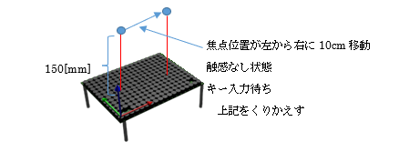

## 5.4 焦点移動及びON/OFFサンプル(sample03_move.py)

### 動作概要
このサンプルは、AUTD3デバイスの上の触覚を感じる焦点が左右に移動し、
右端に達した時に触感が一定期間(１秒)停止します。



焦点の移動は、ミリ単位で単一焦点位置を変化させて発生させることで実現しています。

触感出力の停止は、NullというGainを指示(送信)する事で実現します。  
　　Focus等のGainを送信	：　触感ON  
　　Nullを送信　　　　　 ：　触感OFF  

コンソールより下記コマンドを入力することで実行できます。

``` sh
python3 PythonSample/sample03_move.py
```

「空Enter入力で繰り返し(なにか入力してEnterで終了)」が表示された時、
何も入力せずにEnterキーを押すと繰り返し実行します。
何か入力してEnterキーを押すと、終了します。

<br>

### コード説明

コード全体を下記に示します。

``` python
import numpy as np      # 科学技術用パッケージの準備

from pyautd3 import (   # AUTD3パッケージの準備
    AUTD3,                  # 触覚ボードの定義
    Controller,             # 触覚ボード制御
    Focus,                  # 単一焦点を生成するGain
    FocusOption,            # 単一焦点用オプション
    Null,                   # 出力停止Gain
    Silencer,               # 可聴音抑止
    Sine,                   # 正弦波
    SineOption,             # 正弦波オプション
    Hz,                     # 周波数指定
)
from pyautd3_link_ethercrab import EtherCrab, EtherCrabOption, Status # EtherCrab用パッケージの準備
import time             # 時間調整用のパッケージ準備

# デバイスエラー発生時の処理
def err_handler(idx: int, status: Status) -> None:
    # エラー内容の表示
    print( f"Device[{idx}]: {status}" ) 

# デモ開始
print( "<焦点移動デモ>" )

# デバイスへの接続(EtherCrabを使用)
autd = Controller.open(
            [ # AUTD3ボードの指定
                AUTD3(pos=[0.0, 0.0, 0.0], rot=[1, 0, 0, 0]) # １枚目のボードの位置と向き
            ],
            EtherCrab( # EtherCrabでの接続
                err_handler=err_handler, # エラー発生時の処理関数指定
                option=EtherCrabOption() # デフォルトオプション
            ) 
        )

# 可聴音を抑えるための指示
autd.send( Silencer() )

# 正弦波用意(移動中に変更しないため事前に指示)
m = Sine( # Sin振幅
        freq=150 * Hz, # 150Hz
        option=SineOption() ) # デフォルトオプション
autd.send( m ); # 変調制御を指示

# 入力があるまでループ
print( "動作開始" )
loop = True
while loop:

    # -50mmから+50mmまで移動
    for idx in range(-50, 50):

        # 単一焦点設定
        g = Focus(
                pos=autd.center() + np.array( [idx, 0.0, 150.0] ), # 中心から横に-50～+50mmの位置を指定
                option=FocusOption() ) # デフォルトオプション
        autd.send( g ) # 位相制御を指示

        # 時間調整
        time.sleep( 0.01 ) # 0.01秒(10ミリ秒)待機

    # 停止
    autd.send( Null() )

    # 終了確認
    ans = input( "空Enter入力で繰り返し(なにか入力してEnterで終了)" )
    if ans != "":
        break # 空入力でない場合、終了

# デバイスへの接続終了
autd.close()
```

<br>
 
コードの詳細について説明します。

可聴音を抑える為の指示部分までと最後の切断処理は、「単一焦点サンプル」とほぼ同様のため
「5.2単一焦点サンプル」を参照願います。
ただし、下記のパッケージ宣言が追加されています。

``` python
import time             # 時間調整用のパッケージ準備
```

上記は、時間調整(待機)する為の関数(sleep)を使用するための宣言となります。

<br>

``` python
# 正弦波用意(移動中に変更しないため事前に指示)
m = Sine( # Sin振幅
        freq=150 * Hz, # 150Hz
        option=SineOption() ) # デフォルトオプション
autd.send( m ); # 変調制御を指示
```

上記で正弦波によるAM変調を定義し、送信しています。
AM変調自体は単焦点サンプルと同じですが、焦点が移動中は変化しないため、
ループの前で送信しています。

``` python
# 入力があるまでループ
print( "動作開始" )
loop = True
while loop:

    # -50mmから+50mmまで移動
    for idx in range(-50, 50):

        # 単一焦点設定
        (略)

        # 時間調整

    # 停止
    (略)

    # 終了確認
    (略)
```

上記は繰り返し動作（左から右への焦点移動、停止、終了確認）のループ処理の概要になります。  
（各項目のコードは次ページ以降で解説するため省略しています）

終了確認で変数loopがfalseになるまで繰り返します。

<br>

``` python
       # 単一焦点設定
        g = Focus(
                pos=autd.center() + np.array( [idx, 0.0, 150.0] ), # 中心から横に-50～+50mmの位置を指定
                option=FocusOption() ) # デフォルトオプション
        autd.send( g ) # 位相制御を指示
```

ループ内の単一焦点設定では、移動する焦点の位置に合わせたGain(Focus)を生成し、送信しています。
autd.center()が全体の中心位置であり、-50～50の範囲で変化する変数idxをｘ座標オフセットとして
焦点位置posを設定しています。

``` python
        # 時間調整
        time.sleep( 0.01 ) # 0.01秒(10ミリ秒)待機
```

上記の時間調整は、ゆっくりと焦点位置を移動させるための待機処理となります。

``` python
    # 停止
    autd.send( Null() )
```

横移動ループが終了後、上記にて出力を停止しています。
ループして次の単一焦点設定を送信した時に出力は(新しい位置で)再開されます。
