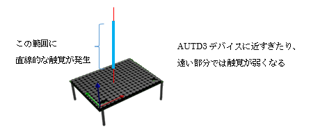
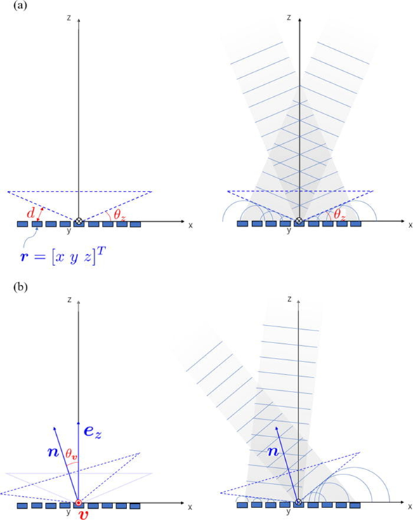

## 5.5 ベッセルビームサンプル(sample04_bessel.py)
### 動作概要

このサンプルは、AUTD3デバイスにてベッセルビームを発生させ、
一か所の焦点ではなく直線的な範囲の触覚を発生させます。




コンソールより下記コマンドを入力することで実行できます。

``` sh
python3 PythonSample/sample04_bessel.py
```

Enterキーを押すと、終了します。


<br>

### コード説明
コード全体を下記に示します。

``` python
import numpy as np      # 科学技術用パッケージの準備

from pyautd3 import (   # AUTD3パッケージの準備
    AUTD3,                  # 触覚ボードの定義
    Controller,             # 触覚ボード制御
    Bessel,                 # ベッセルビームを生成するGain
    BesselOption,           # ベッセルビーム用オプション
    rad,                    # ラジアン単位指定
    Silencer,               # 可聴音抑止
    Sine,                   # 正弦波
    SineOption,             # 正弦波オプション
    Hz,                     # 周波数指定
)
from pyautd3_link_ethercrab import EtherCrab, EtherCrabOption, Status # EtherCrab用パッケージの準備

# デバイスエラー発生時の処理
def err_handler(idx: int, status: Status) -> None:
    # エラー内容の表示
    print( f"Device[{idx}]: {status}" ) 


# デモ開始
print( "<ベッセルビームデモ>" )

# デバイスへの接続(EtherCrabを使用)
autd = Controller.open(
            [ # AUTD3ボードの指定
                AUTD3(pos=[0.0, 0.0, 0.0], rot=[1, 0, 0, 0]) # １枚目のボードの位置と向き
            ],
            EtherCrab( # EtherCrabでの接続
                err_handler=err_handler, # エラー発生時の処理関数指定
                option=EtherCrabOption() # デフォルトオプション
            ) 
        )

# 可聴音を抑えるための指示
autd.send( Silencer() )

# 動作指定
g = Bessel( # ベッセルビームの位相制御
        apex=autd.center(), 
        direction=np.array([0.0, 0.0, 1.0]), 
        theta=13.0 / 180 * np.pi * rad, 
        option=BesselOption()
    )
m = Sine( # Sin振幅
        freq=150 * Hz, # 150Hz
        option=SineOption(), # デフォルトオプション
    )
print( "動作開始" )
autd.send( (m,g) ) # 位相制御と振幅制御を指示

# キー入力待ち(終了指示待ち)
print( "Enterキー入力で終了" )
_= input()

# デバイスへの接続終了
autd.close()
```

<br>

コードの詳細について説明します。

可聴音を抑える為の指示部分までと最後の待機/切断処理は、「単一焦点サンプル」とほぼ同様のため
「5.2単一焦点サンプル」を参照願います。
ただし、下記のパッケージ宣言が追加されています。

``` python
    Bessel,                 # ベッセルビームを生成するGain
    BesselOption,           # ベッセルビーム用オプション
    rad,                    # ラジアン単位指定
```

上記は、ベッセルビームを生成する位相制御(Bessel)を使用する為の宣言となります。

<br>

``` python
# 動作指定
g = Bessel( # ベッセルビームの位相制御
        apex=autd.center(), 
        direction=np.array([0.0, 0.0, 1.0]), 
        theta=13.0 / 180 * np.pi * rad, 
        option=BesselOption()
    )
m = Sine( # Sin振幅
        freq=150 * Hz, # 150Hz
        option=SineOption(), # デフォルトオプション
    )
print( "動作開始" )
autd.send( (m,g) ) # 位相制御と振幅制御を指示
```

上記でベッセルビームを発生させる位相制御とAM変調制御を定義し送信しています。

ベッセルビームの位相制御は、ビームを生成する仮想円錐の頂点(apex)とビームの方向(direction)、及び、ビームに垂直な面と仮想円錐側面との角度(theta)を指定して定義します。




参考：https://shinolab.github.io/autd3-doc/jp/Users_Manual/API/gain/bessel.html

変調制御は単焦点サンプルと同じ「正弦波:Sine」を指定しています。
