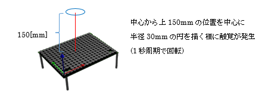
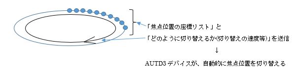

## 5.6 STMサンプル(sample05_stm.py)

### 動作概要
このサンプルは、Spatio-Temporal Modulation:時空間変調(STM)をもちいて、
時間とともに変化する焦点を発生させます。



コンソールより下記コマンドを入力することで実行できます。

``` sh
python3 PythonSample/sample05_stm.py
```

Enterキーを押すと、終了します。

サンプルは単焦点サンプルと同様に位相制御等を送信後はキー入力があるまでプログラムは待機状態となりますが、焦点移動サンプルの様に触覚の移動が繰り返されます。

ライブラリでは下記のSTM機能を提供しています。  
　　FociSTM		：８つまでの焦点を制御するSTM  
　　GainSTM　	：任意のGainを組み合わせて制御するSTM  
本サンプルではFociSTMを使用します。

FociSTMでは、「焦点の発生座標リスト」と「焦点の切り替え周期」を決定するパラメタを
AUTD3デバイスに送信し、AUTD3デバイス内で自動的に焦点座標を切り替えさせることで
焦点の動きを実現します。



本サンプルでは、「200個の焦点座標リスト」と「1Hz」のパラメタを送信していますので、
円を描く200点の焦点が1秒周期で回転するような触覚が発生します。

<br>

### コード説明

コード全体を下記に示します。

``` python
import numpy as np      # 科学技術用パッケージの準備

from pyautd3 import (   # AUTD3パッケージの準備
    AUTD3,                  # 触覚ボードの定義
    Controller,             # 触覚ボード制御
    FociSTM,                # Focus制御STM
    Silencer,               # 可聴音抑止
    Static,                 #
    Hz,                     # 周波数指定
)
from pyautd3_link_ethercrab import EtherCrab, EtherCrabOption, Status # EtherCrab用パッケージの準備

# デバイスエラー発生時の処理
def err_handler(idx: int, status: Status) -> None:
    # エラー内容の表示
    print( f"Device[{idx}]: {status}" ) 


# デモ開始
print( "<時空間変調デモ>" )

# デバイスへの接続(EtherCrabを使用)
autd = Controller.open(
            [ # AUTD3ボードの指定
                AUTD3(pos=[0.0, 0.0, 0.0], rot=[1, 0, 0, 0]) # １枚目のボードの位置と向き
            ],
            EtherCrab( # EtherCrabでの接続
                err_handler=err_handler, # エラー発生時の処理関数指定
                option=EtherCrabOption() # デフォルトオプション
            ) 
        )

# 可聴音を抑えるための指示
autd.send( Silencer() )

# 動作指定
radius = 30.0   # 動きの半径
reso = 200      # 動きの分解能
center = autd.center() + np.array([0.0, 0.0, 150.0]) # 動きの中心位置
stm = FociSTM(
        foci=(center + radius * np.array([np.cos(theta), np.sin(theta), 0]) 
            for theta in ( 2.0 * np.pi * i / reso for i in range(reso)) # 分解能に合わせて角度決定
        ),
        config=1.0 * Hz,
    )
m = Static()
print( "動作開始" )
autd.send( (m,stm) ) # 位相制御と振幅制御を指示

# キー入力待ち(終了指示待ち)
print( "Enterキー入力で終了" )
_= input()

# デバイスへの接続終了
autd.close()
```

コードの詳細について説明します。

可聴音を抑える為の指示部分までと最後の待機/切断処理は、「単一焦点サンプル」とほぼ同様のため
「5.2単一焦点サンプル」を参照願います。
ただし、下記のパッケージ宣言が追加されています。

``` python
    FociSTM,                # Focus制御STM
    Static,                 #
    Hz,                     # 周波数指定
```

上記は、FociSTMによるSTMと固定の変調制御を使用する為の宣言となります。

<br>

``` python
# 動作指定
radius = 30.0   # 動きの半径
reso = 200      # 動きの分解能
center = autd.center() + np.array([0.0, 0.0, 150.0]) # 動きの中心位置
stm = FociSTM(
        foci=(center + radius * np.array([np.cos(theta), np.sin(theta), 0]) 
            for theta in ( 2.0 * np.pi * i / reso for i in range(reso)) # 分解能に合わせて角度決定
        ),
        config=1.0 * Hz,
    )
```

上記では中心位置(autd.center())を中心とした半径:radius(30.0)[mm]の円の円周上の
200点の座標リスト(foci)と１Hzで繰り返す周期設定(config)を指定し、FociSTM(stm)を定義しています。

``` python
m = Static()
```

本サンプルでは変調制御としてStaticを使用しています。  
他サンプルの正弦波Sineと違いAM変調が付与されませんが、
STMにより焦点が次々と変化するため触感を感じられます。
