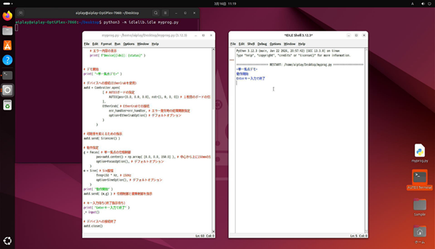

# 6. その他
## 6.1 キットでの独自プログラムの作成と実行
Ubuntu標準のテキストエディタやPython付属の総合開発環境IDLEがインストールされています。  
これらを使用してプログラムを編集/保存し、サンプルプログラムと同様のコマンドで
実行することができます。  
（保存先を/home/aiplay/Desktop下にすることでデスクトップにアイコンが表示され、
サンプルと同様の手順で実行できます）

「AUTD3 Terminal」にて下記コマンドを実行すれば
総合開発環境IDEL下でプログラムの編集と実行が可能です。

``` sh
　　python3 -m idlelib.idle ファイル名
```

IDLEを使用した独自プログラムの作成/実行例



① 「AUTD3 Terminal」上で上記コマンドを実行  
② 編集ウィンドウ内にプログラムを入力  
③ メニュー「Run」-「Run Module」(F5)で実行ウィンドウが表示されプログラムが実行  

