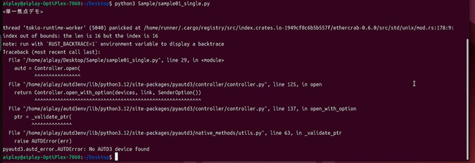
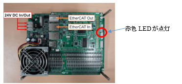
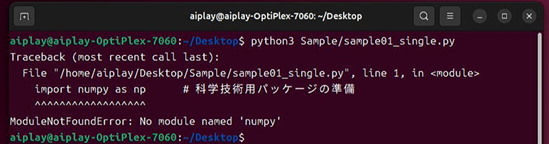

## 6.2 実行時エラー等

## No AUTD3 device found
サンプル実行時に下記の様な出力となった場合は、
以下の点を確認してください。　　
 
 

```
pyautd3.autd_error.AUTDError: No AUTD3 device found
```


①  
AUTD3デバイスの電源ケーブルが正しく接続されていることを確認してください。  
また電源ユニット(24V)の電源がONになっていることを確認してください。



AUTD3デバイスは電源が入っている場合、上記のLEDが点灯します。

②  
AUTD3デバイスとPCが正しいコネクタに接続されていることを確認して下さい。  
AUTD3デバイス側は中央のLANコネクタに接続します。  
正しく接続されている場合、LANコネクタの緑と黄色のLEDが点灯します。  
(PCとはHUB等を経由せずに接続してください。また別のケーブルでの接続を確認下さい)

③  
WiFiデバイスやUSB-LANデバイス(有線LAN)等は接続しないでください。  
複数のネットワークデバイスがあった場合でも、  
通常はライブラリが自動的に適切なネットワークデバイスを選択しますが、  
失敗した場合上記の様な状況になる場合があります。

<br>

## No module named 'numpy'

サンプル実行時に下記の様な出力となった場合、
適切なPython仮想環境で実行されていない可能性があります。



``` 
　ModuleNotFoundError: No module named 'numpy'
```

デスクトップの「AUTD3 Terminal」アイコンから起動するターミナルから入力するか、
下記コマンドで仮想環境に切り替えた後にプログラムを実行して下さい。

``` sh
　　source /home/aiplay/autd3env/bin/activate
```

<br>

## AUTD3デバイスのファン

AUTD3デバイスを長時間動作させた場合、ボードが熱を持ち自動的に冷却用のファンが動き出します。  
ファンが動作している状態でも動作に問題はありません。
