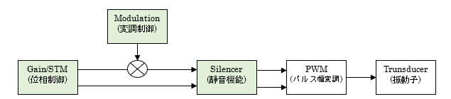
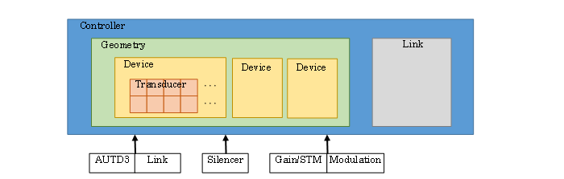

# 3. 制御手順
## 3.1 基本構造

AUTD3デバイスが動作する際の概念図を下記に示す。  

| ブロック | 役割 |
| --- | --- |
| Gain | 位相/振幅を管理する。 |
| STM | Spatio-Temporal Modulation(時空間変調)機能で、位相/振幅を時間列で管理する。 |
| Modulation | AM変調を管理する。 |
| Silencer | 静音化処理を管理する。 |
| PWM | 上記データに基づき、各振動子を駆動させる電気信号を生成する。 |
| Trunsducer | 電気信号により超音波を発生させる。 |

AUTD3ライブラリの主な構成要素を下記に示す。  
(上記動作概念図中の要素と同名のクラスは、その要素の動作や状態等を管理する)  

| コンポーネント | 概要 |
| --- | --- |
| Controllerクラス | AUTD3デバイスに対する接続/指示送信などの操作を行う。 |
| AUTD3クラス | 個々のAUTD3デバイス情報を管理する。 |
| Geometryクラス | AUTD3デバイス群を管理する。 (GeometryクラスはDeviceクラスのコンテナであり、DeviceクラスはTransducerクラスのコンテナ) |
| Linkクラス[^1] | AUTD3デバイスとの通信を管理する。 TwinCAT接続(TwinCATクラス)、EtherCrab接続(EtherCrabクラス)などがある。 |
| Gainクラス | 位相/振幅を管理する。 |
| STMクラス | Spatio-Temporal Modulation(時空間変調)機能で、位相/振幅を時間列で管理する。 |
| Modulationクラス[^1] | AM変調処理を管理する。 正弦波(Sineクラス)、矩形波(Squareクラス)などがある。 |
| Silencerクラス | 静音化処理を管理する。 |

[^1]: 実際にはこれらのクラスを継承したクラスを使用する。

参考：https://shinolab.github.io/autd3-doc/jp/Users_Manual/tutorial/concept.html
