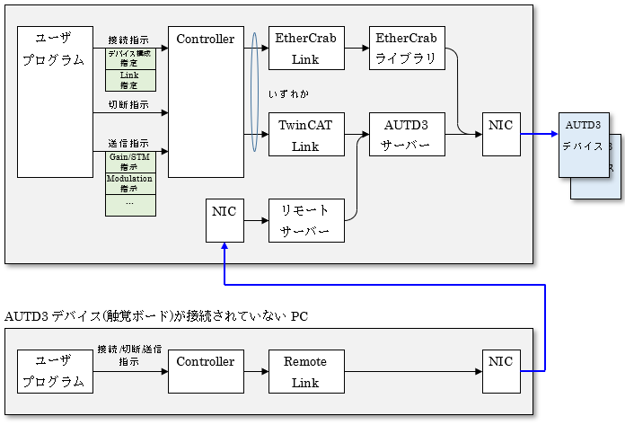

## 3.2 モジュール構成とデータの流れ

各モジュールの関連とデータの流れの概要を下記に示す。

ユーザプログラムコードは「Controller」に対してデバイスを動作させる各種操作を指示し、  
「Controller」は各種「Link」経由でデバイスとの通信を行う。

Pythonでは下記の「Link」が提供されている。  

|Link名 | 内容 |
| --- | --- |
| TwinCAT Link | AUTD3サーバー(TwinCATライブラリ)経由でデバイスと通信 |
| EtherCrab Link | EtherCrabライブラリ(オープンソースライブラリ) 経由でデバイスと通信 |
| Remote Link | リモートサーバ |

「リモートサーバー」を用いる場合、デバイスが接続されていないPCから各種制御を行うこともできる。

ユーザプログラムは位相制御(Grain/STM)や変調制御(Modulation)等の指示(Datagramを継承したクラス)をController経由でAUTD3デバイスに送信し、デバイスの動作を決定する。

