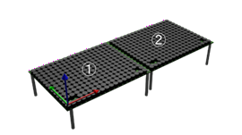

## 4.2 Controllerクラス
### 概要
AUTD3デバイスに対する操作の指示、及び、現在の状態の提供等を行う。  
このクラスはGeometryクラスを継承する。  
参照：https://shinolab.github.io/autd3-doc/jp/Users_Manual/API/controller.html  

---

### 生成
Controllerクラスのスタティックメソッド「openメソッド」を用いて生成する。  

---

### openメソッド
| 引数/戻り値:型 | 内容 |
| --- | --- |
| devices: Iterable[AUTD3] | 構成するAUTD3クラスのリスト |
| link: Link | 使用するリンク |
| 戻り値: Controller | Controllerインスタンス |

AUTD3デバイスとの通信を開始し、戻り値としてControllerインスタンスを返す。

下記の様に２つのAUTD3デバイスを横に並べて設置し、  
EtherCrabリンクを用いる場合の引数は下記の様になる。  
  

``` python
# デバイスへの接続(EtherCrabを使用)
autd = Controller.open(
            [ # AUTD3ボードの指定
                AUTD3(pos=[0.0, 0.0, 0.0], rot=[1, 0, 0, 0]), # １枚目のボードの位置と向き
　　　　　　　　AUTD3( pos=[AUTD3.DEVICE_WIDTH, 0.0, 0.0 ], rot=[1, 0, 0, 0] ) # ２枚目
            ],
            EtherCrab( 
                err_handler=err_handler, # エラー発生時の処理関数指定
                option=EtherCrabOption() # デフォルトオプション
            ) 
        )
```

---

### closeメソッド
| 引数/戻り値:型 | 内容 |
| --- | --- |
| 引数なし |
| 戻り値なし |

AUTD3デバイスとの通信を終了する。

---

### sendメソッド
| 引数/戻り値:型 | 内容 |
| --- | --- |
| d: Datagram \| <Br> tuple[Datagram, Datagram] | 送信するデータ(指示) |
| 戻り値 | なし |

AUTD3デバイスにデータ(各種指示)を送信する。  

引数には下記のデータ(クラス)を指定する。  
| 送信できるデータ(クラス)| 内容 |
| --- | ---  |
| Bessel| ベッセルビームGain指示 |
| Custom| 自由な音場Gain指示 |
| FociSTM| 単一焦点～8焦点までをサポートするSTM指示 |
| Focus| 単焦点Gain指示 |
| ForceFan| 強制ファン動作指示 |
| GainSTM| 任意GainをサポートするSTM指示 |
| GPIOOutputs| GPIO出力指定指示 |
| Group| AUTD3デバイスのグループ設定 |
| Null| ゼロ振幅Gain指示 |
| OutputMask| 出力マスク指示 |
| PhaseCorrection| 位相補正指示 |
| Plane| 平面波Gain指示 |
| PulseWidthEncoder| PWMパルス幅変更指示 |
| ReadsFPGAState| FPGA状態取得指示 |
| Silencer| サイレンサ指示 |
| SwapSegmentFociSTM| FociSTMセグメント切り替え指示 |
| SwapSegmentGain| Gainセグメント切り替え指示 |
| SwapSegmentGainSTM| GainSTMセグメント切り替え指示 |
| SwapSegmentModulation| Modulationセグメント切り替え指示 |
| Uniform| 全振動子への同一位相/振幅指示 |
| WithFiniteLoop| Modulation及びFociSTM/GainSTMのループ設定指示 |
| WithSegment| セグメント指定送信指示 |


引数値を2要素タプルにすることにより、二つのデータを同時に送信することができる。
``` python
g = Focus( # 単一焦点の位相制御
        pos=autd.center() + np.array( [0.0, 0.0, 150.0] ), # 中心から上に150mmの位置
        option=FocusOption(), # デフォルトオプション
    )
m = Sine( # Sin振幅
        freq=150 * Hz, # 150Hz
        option=SineOption(), # デフォルトオプション
    )
autd.send( (m,g) ) # 位相制御と振幅制御を同時に送信
```

---

### firmware_versionメソッド

| 引数/戻り値:型| 内容 |
| --- | ---  |
| 引数なし|  |
| 戻り値:list[FirmwareInfo]| AUTD3デバイス毎のファームウェア情報 |

戻り値としてAUTD3デバイスのファームウェアバージョンのリストを返す。

---

### geometryメソッド
| 引数/戻り値:型| 内容 |
| --- | ---  |
| 引数なし|  |
| 戻り値: geometry| geometry情報 |

戻り値として現在AUTD3デバイス情報(geometryクラス)を返す。

---

### linkメソッド
| 引数/戻り値:型| 内容 |
| --- | ---  |
| 引数なし|  |
| 戻り値: link| 現在のlinkインスタンス |

通信で使用ているLinkインスタンスを返す。


---

### senderメソッド
| 引数/戻り値:型| 内容 |
| --- | ---  |
| option: SenderOption| 送信設定 |
| 戻り値 : Sender| Senderインスタンス |

指定された送信設定が適用された送信管理を返す。

送信設定(SenderOption)には、下記を指定する。
| 引数:型| 内容 |
| --- | ---  |
| send_interval: Duration| 送信間隔 |
| receive_interval: Duration| 受信間隔 |
| timeout: Duration| タイムアウト時間 |


---

### centerメソッド/num_deveicesメソッド/num_transducersメソッド
現在のデバイス状態を返す。詳細はGeometryクラスの同名メソッドを参照。


---

### fpga_stateメソッド
| 引数/戻り値:型| 内容 |
| --- | ---  |
| なし|  |
| 戻り値 : list[FPGAState]| Senderインスタンス |

AUTD3デバイス(FPGA)の状態を取得する。

このメソッドを呼び出す前に、ReadsFPGAStateを送信し、状態取得を有効化しておく必要がある。
``` python
　　autd.send( ReadFPGAState(lambda _: True) )
　　info = autd.fpga_state()
```
