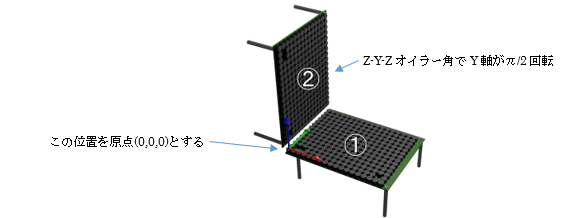

## 4.3 AUTD3クラス

### 概要
接続されている個々のAUTD3デバイス情報を管理する。  
AUTD3デバイスの物理的な設置状態に合わせて定義し、接続時に指定する。

---

### コンストラクタ
| 引数:型| 内容 |
| --- | ---  |
| pos: ArrayLike| AUTD3ボードの位置(座標を[x,y,z]で指定) |
| rot: ArrayLike| AUTD3ボードの向き(ベクトルを[x,y,z,w]で指定) |

横に2台並べて設置する場合は、下記の様な定義となる。

``` python
① AUTD3( pos=[0.0, 0.0, 0.0 ], rot=[1, 0, 0, 0] )
② AUTD3( pos=[AUTD3.DEVICE_WIDTH, 0.0, 0.0 ], rot=[1, 0, 0, 0] )

```

下記の様に立体的に配置する場合、下記の様な定義となる。

``` python
① AUTD3( pos=[0.0, 0.0, 0.0 ], rot=[1, 0, 0, 0] )
② AUTD3( pos=[0.0, 0.0, AUTD3.DEVICE_WIDTH ], 
         rot= EulerAngles.ZYZ(0 * rad, np.pi / 2 * rad, 0 * rad )
```

Controllerクラスのopenメソッドの第1引数に上記のリストを指定する。

参考：https://shinolab.github.io/autd3-doc/jp/Users_Manual/tutorial/multiple.html

