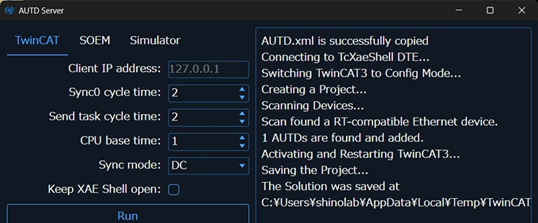
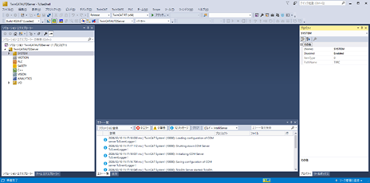
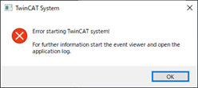
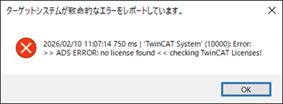

## 4.5 TwinCATクラス

### 概要
TwinCATを用いてAUTD3デバイスと通信を行う。  
Linkクラスを継承する。(Controllerのopenメソッドにて指定する)  

参照：https://shinolab.github.io/autd3-doc/jp/Users_Manual/API/link/twincat.html  

---

### コンストラクタ
引数無しでTwinCAT用のLinkオブジェクトを生成する。

---

### AUTD3 Server
TwinCATリンクを使用する場合、事前にAUTD3 Serverを起動し、  
Runボタン押下で接続可能な状態にしておく必要がある。

AUTD3デバイスが見つかった場合、  
サーバー画面には下記の様なメッセージ(x AUTDs are found and added.)が表示され、  
TcXaeShell画面(Visual studio)が表示される。  

  

---

下記の様なダイアログが表示された場合、TwinCATのライセンスが失効している可能性がある。

    

ライセンスが失効した場合、TcXaeShell画面にて適切なライセンス情報を登録する必要がある。  
７日間有効なトライアルライセンスを発行する手順は下記を参照。

[TwinCATトライアルライセンス発効手順](./twincat_license.md)

