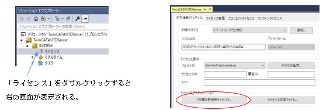

### TwinCATトライアルライセンス発効手順

①
TcXaeShell(Visual Studio)ウィンドウの「ソリューションエクスプローラ」から  
TwinCATAUTDServer」－「SYSTEM」を展開し、  
「ライセンス」をダブルクリックして「TwinCATAUTDServer」のダイアログを表示させる。

②  
「7日間の評価用ライセンス…」をクリックし「セキュリティコードの入力」画面が表示させ、  
画面に表示された文字を入力する。

③  
TcXaeShell(Visual Studio)ウィンドウを右上の×ボタンで閉じて、  
AUTD3サーバー画面のRunボタンを再度クリックする。

