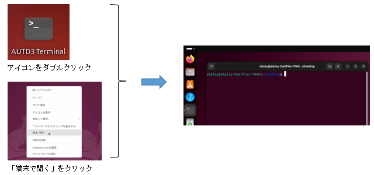

## 4.2 ビルド及び実行方法
Rustサンプルはソースファイルのみとなっているため、
実行するにはプロジェクトを作成しビルドを行う必要があります。

---

### 4.2.1 プロジェクト作成
ビルドを行うため、下記手順でサンプル用のプロジェクトを作成します。

① ターミナル起動(コンソール画面)  
デスクトップで右クリックメニューより「端末で開く」を選択するか、  
アイコン「AUTD3 Terminal」をダブルクリックしてターミナルウィンドウをを開きます。



---


② プロジェクト作成、及び、サンプルソースのコピー  
下記コマンドにてプロジェクトフォルダを作成し、サンプルソースをコピーします。

```
$ cargo new --bin プロジェクトフォルダ名
$ cd プロジェクトフォルダ名
$ cp ~/Desktop/RustSample/サンプルソース名(Sample??_????.rs) src/main.rs
```

---


③ 外部ライブラリ(クレート)の追加  
下記コマンドにてビルドに必要な外部ライブラリ(クレート)をプロジェクトに追加します。  
```
$ cargo add autd3 --offline
$ cargo add autd3-link-ethercrab --offline
```
複数焦点サンプルの場合、下記も追加します  
```
$ cargo add autd3-gain-holo --offline
```

必要なライブラリはキット内にダウンロード済みですので、  
「```--offline```」をつけてローカル(キャッシュ)にあるライブラリを追加します。  
（キットはインターネットに接続しない環境での動作を想定していますので、  
　かならず「```--offline```」オプションを指定する様にして下さい）


---

### 4.2.2 ビルド

下記コマンドにてビルドを行います。  
``` sh
$ cargo build
```

ビルドに成功した場合、下記に実行ファイルが作成されます。  
```
プロジェクトフォルダ/target/debug/プロジェクトフォルダ名
```

---

### 4.2.3 実行
AUTD3デバイスとの通信で使用するアプリは、  
ネットワークインターフェースにてRAWパケットを使用する権限が必要となります。

この為、一時的に実行するには下記の様にsudoコマンドを用いてroot権限で実行します。  
``` sh
$ sudo ./target/debug/プロジェクトフォルダ名
```


