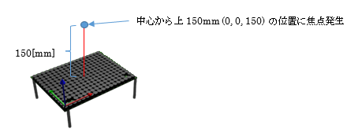
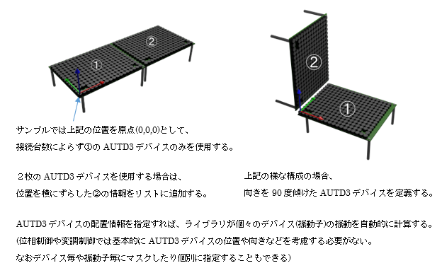
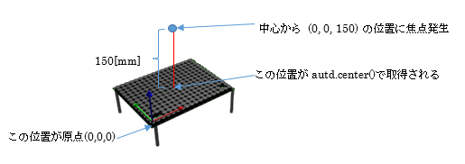

## 5.2 単一焦点サンプル(Sample01_single.rs)

### 動作概要
このサンプルは、１枚のAUTD3デバイスの中央上部(デバイス表面から15cm上)に
触覚を感じる焦点を発生させます。




コンソールより下記コマンドを入力することで実行できます。

``` sh
$ cargo new --bin sample01					                プロジェクト作成
$ cd sample01							                    プロジェクトフォルダに移動
$ cp ~/Desktop/RustSample/Sample01_single.rs src/main.rs	サンプルコードのコピー
$ cargo add autd3 --offline					                autd3ライブラリ追加
$ cargo add autd3-link-ethercrab --offline			        ethercrabライブラリ追加
$ cargo build							                    ビルド
$ sudo ./target/debug/sample01					            実行
```

Enterキーを押すと終了します。

---

### コード説明

コード全体を下記に示します。

``` rust
// AUTD3ライブラリの使用宣言
use autd3::prelude::*;

// EtherCrabライブラリの使用宣言
use autd3_link_ethercrab::{EtherCrab, EtherCrabOption};

// ------------------------------------------------------------
// メイン関数
fn main() ->Result<(), Box<dyn std::error::Error>> {

    println!( "<単一焦点デモ>" );

    // デバイスへの接続
    println!( "デバイス接続" );
    let devices = [AUTD3 {
            pos: Point3::origin(),
            rot: UnitQuaternion::identity(),
        }];
    let link = EtherCrab::new(
            |idx, status| {
                eprintln!( "Device[{}]: {}", idx, status );
            },
            EtherCrabOption::default()
        ); 
    let mut autd = Controller::open( devices, link )?;

    // 可聴音を抑えるための指示
    autd.send( Silencer::default() )?;

    // 単一焦点の位相制御指示を生成
    let g = Focus {
                pos: autd.center() + Vector3::new( 0., 0., 150.0 * mm ),
                option: FocusOption::default()
            };

    // Sin波形の変調制御指示を生成
    let m = Sine {
                freq: 150 * Hz,
                option: SineOption::default()
            };

    // 位相制御と変調制御を送信(動作開始)
    println!( "動作開始" );
    autd.send( (m, g) )?;

    // キー入力待ち(終了指示待ち)
    let mut _s = String::new();
    println!( "Enterキー入力で終了" );
    std::io::stdin().read_line( &mut _s )?;

    // デバイスとの接続終了
    autd.close()?;

    // 終了
    Ok( () )
}

```

---
<br>

コードの詳細について説明します。  
``` rust
// AUTD3ライブラリの使用宣言
use autd3::prelude::*;

// EtherCrabライブラリの使用宣言
use autd3_link_ethercrab::{EtherCrab, EtherCrabOption};
```
  上記では使用する外部ライブラリクラスを宣言しています。
  
| パッケージ |  内容/用途 |
| --- | --- |
| autd3 | AUTD3ライブラリ |
| autd3_link_ethercrab | EtherCrab用ライブラリ |

<br>

``` rust
   // デバイスへの接続
    println!( "デバイス接続" );
    let devices = [AUTD3 {
            pos: Point3::origin(),
            rot: UnitQuaternion::identity(),
        }];
    let link = EtherCrab::new(
            |idx, status| {
                eprintln!( "Device[{}]: {}", idx, status );
            },
            EtherCrabOption::default()
        ); 
    let mut autd = Controller::open( devices, link )?;
```
デバイスへの接続はControllerクラスのopenメソッドにより行います。  
引数として、AUTD3デバイスのリストと接続に使用するLinkとしてEtherCrabを指定しています。


本サンプルではAUTD3デバイスを１枚のみ使用しますのでリストは  
```
    基準位置(0, 0, 0)	 原点(Point3::origin)
    向き(1, 0, 0, 0)     上向き(UnitQuaternion::identity)
```
の１件のみとなっていますが、  
複数のAUTD3デバイスを使用する場合は、各デバイス毎の位置と方向を列挙します。
  


EtherCrabを用いて接続を行う場合は、  
エラー発生時呼び出される処理(エラーハンドル)とオプションを指定する必要があります。

``` rust
    |idx, status| {
        eprintln!( "Device[{}]: {}", idx, status );
    }
```

サンプルではエラーハンドルとしてエラーメッセージを表示するだけの処理をクロージャで指定しています。

またデフォルトのオプション(引数なし)を指定していますが、  
必要によってネットワークインターフェースや同期タイミング等を指定できます。


---
<br>

``` rust
    // 可聴音を抑えるための指示
    autd.send( Silencer::default() )?;
```
上記では、可聴音を抑制するSilencerを指示しています。  
`Silencer()::disable()`を送信すれば、消音処理を無効化できます。  

<br>

``` rust
    // 単一焦点の位相制御指示を生成
    let g = Focus {
                pos: autd.center() + Vector3::new( 0., 0., 150.0 * mm ),
                option: FocusOption::default()
            };

    // Sin波形の変調制御指示を生成
    let m = Sine {
                freq: 150 * Hz,
                option: SineOption::default()
            };
```
上記で「単一焦点の位相制御Focus」と「正弦波変調Sine」の定義を行っています。  

Focusの引数は「焦点座標(pos)」と「オプション(option)」を指定します。  
「autd.center()」は全AUTD3デバイスの中心位置を表し  
オフセット成分「Vector3::new ( 0., 0., 150.0 * mm )」を加算することで  
AUTDデバイス中心の上方向150.0[mm]の位置を焦点座標としています。  
  

変調制御として「正弦波:Sine」を指定しています。  
変調なし(Static)の場合、動きがないと触覚を感じられません。  
周波数は「150Hz」を指定していますが、この値を変更すると触感が変化します。  

<br>

``` rust
    // 位相制御と変調制御を送信(動作開始)
    println!( "動作開始" );
    autd.send( (m, g) )?;

    // キー入力待ち(終了指示待ち)
    let mut _s = String::new();
    println!( "Enterキー入力で終了" );
    std::io::stdin().read_line( &mut _s )?;
```
上記の「send()」にて位相制御と変調制御をAUTD3デバイスに送信し、触覚を発生させます。  

位相制御や変調制御は、送信する毎に上書きされます。  
（最後に送信された制御が使用されます）  

Focusでは単一位置で固定強度の焦点を発生させます。  
細かく位相を変化させたい場合(焦点位置をブレさせたり、強さを変化させたい場合)などは  
「STM：時空間変調」が有効です。

送信後はEnterキーが押されるまで待機します。  
（プログラムが終了すると超音波出力も終了するため、キー入力があるまで出力が継続される様にしています）

<br>

``` rust
    // デバイスとの接続終了
    autd.close()?;
```
上記の「close()」により、AUTDデバイスとの接続を終了します。  

