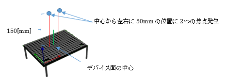
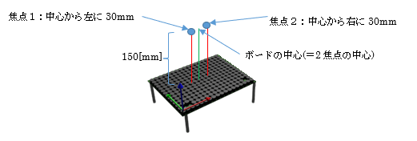

## 5.3 複数焦点サンプル(Sample02_multi.rs)

### 動作概要
このサンプルは、１枚のAUTD3デバイスの上に2つの触覚を感じる焦点を発生させます。




多焦点生成アルゴリズムとして「GSPAT:Gershberg-Saxon for Phased Arrays of Transducers」を使用しています。  
この為、autd3-gain-holoライブラリをプロジェクトに追加する必要があります。


コンソールより下記コマンドを入力することで実行できます。

``` sh
$ cargo new --bin sample02					                プロジェクト作成
$ cd sample02							                    プロジェクトフォルダに移動
$ cp ~/Desktop/RustSample/Sample02_multi.rs src/main.rs		サンプルコードのコピー
$ cargo add autd3 --offline					                autd3ライブラリ追加
$ cargo add autd3-link-ethercrab --offline			        ethercrabライブラリ追加
$ cargo add autd3-gain-holo --offline				        gain-holoライブラリ追加
$ cargo build							                    ビルド
$ sudo ./target/debug/sample02					            実行
```

Enterキーを押すと終了します。

---

### コード説明

コード全体を下記に示します。

``` rust
// AUTD3ライブラリの使用宣言
use autd3::prelude::*;
use autd3_gain_holo::{ Pa, GSPAT, GSPATOption };

// EtherCrabライブラリの使用宣言
use autd3_link_ethercrab::{EtherCrab, EtherCrabOption};

// ------------------------------------------------------------
// メイン関数
fn main() ->Result<(), Box<dyn std::error::Error>> {

    println!( "<複数焦点デモ>" );

    // デバイスへの接続
    println!( "デバイス接続" );
    let devices = [AUTD3 {
            pos: Point3::origin(),
            rot: UnitQuaternion::identity(),
        }];
    let link = EtherCrab::new(
            |idx, status| {
                eprintln!( "Device[{}]: {}", idx, status );
            },
            EtherCrabOption::default()
        ); 
    let mut autd = Controller::open( devices, link )?;

    // 可聴音を抑えるための指示
    autd.send( Silencer::default() )?;

    // 
    let center = autd.center() + Vector3::new( 0., 0., 150.0 * mm );
    let focuslist = vec![
        (center - Vector3::new( 30.0 * mm, 0.0, 0.0 ), 5e3 * Pa),
        (center + Vector3::new( 30.0 * mm, 0.0, 0.0 ), 5e3 * Pa)
    ];
    let g = GSPAT::new (
        focuslist,
        GSPATOption::default()
    );

    // Sin波形の変調制御指示を生成
    let m = Sine {
                freq: 150 * Hz,
                option: SineOption::default()
            };

    // 位相制御と変調制御を送信(動作開始)
    println!( "動作開始" );
    autd.send( (m, g) )?;

    // キー入力待ち(終了指示待ち)
    let mut _s = String::new();
    println!( "Enterキー入力で終了" );
    std::io::stdin().read_line( &mut _s )?;

    // デバイスとの接続終了
    autd.close()?;

    // 終了
    Ok( () )
}
```

---
<br>

コードの詳細について説明します。

なお可聴音を抑える為の指示部分までは、
「単一焦点サンプル」とほぼ同様のため「単一焦点サンプル」を参照願います。  
ただし、下記のパッケージ宣言が追加されています。  

``` rust
use autd3_gain_holo::{ Pa, GSPAT, GSPATOption };
```

上記は、本サンプルで使用している多焦点生成アルゴリズム
「GSPAT:Gershberg-Saxon for Phased Arrays of Transducers」を使用するための宣言となります。

<br>

``` rust
  let center = autd.center() + Vector3::new( 0., 0., 150.0 * mm );
    let focuslist = vec![
        (center - Vector3::new( 30.0 * mm, 0.0, 0.0 ), 5e3 * Pa),
        (center + Vector3::new( 30.0 * mm, 0.0, 0.0 ), 5e3 * Pa)
    ];
```

上記で、GSPATアルゴリズムによる2つの焦点を生成する位相制御を定義しています。

変数「center」にはAUTD3デバイスの中心から上150mmの座標(＝2焦点の中心)が格納されます。

GSPATの引数は、「焦点座標リスト」と「オプション」を指定します。
「焦点座標リスト」は「焦点座標」と「圧力強度」からなるタプルのリストで、
上記コードの場合、  
　　2焦点の中心(center)　から　左に 30mm の位置で、圧力 5×10^3[Pa]  
　　2焦点の中心(center)　から　右に 30mm の位置で、圧力 5×10^3[Pa]  
の２要素が指定されています。  

  


変調制御の定義(Sin振幅)、及び、位相制御と変調制御の送信と待機部分については
「単一焦点サンプル」と同様となります。
