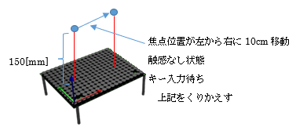

# 5.4 焦点移動及びON/OFFサンプル(Sample03_move.rs)

## 動作概要
このサンプルは、AUTD3デバイスの上の触覚を感じる焦点が左右に移動し、
右端に達した時に触感が一定期間(１秒)停止します。



焦点の移動は、ミリ単位で単一焦点位置を変化させて発生させることで実現しています。

触感出力の停止は、NullというGainを指示(送信)する事で実現します。  
```
　　Focus等のGainを送信  :  触感ON  
　　Nullを送信           :  触感OFF  
```
コンソールより下記コマンドを入力することで実行できます。

``` sh
$ cargo new --bin sample03					                プロジェクト作成
$ cd sample03							                    プロジェクトフォルダに移動
$ cp ~/Desktop/RustSample/Sample03_move.rs src/main.rs		サンプルコードのコピー
$ cargo add autd3 --offline					                autd3ライブラリ追加
$ cargo add autd3-link-ethercrab --offline			        ethercrabライブラリ追加
$ cargo build							                    ビルド
$ sudo ./target/debug/sample03					            実行
```

「空Enter入力で繰り返し(なにか入力してEnterで終了)」が表示された時、  
何も入力せずにEnterキーを押すと繰り返し実行します。  
何か入力してEnterキーを押すと、終了します。

---
<br>

## コード説明

コード全体を下記に示します。

``` rust
// ライブラリの使用宣言
use autd3::prelude::*;
use autd3_link_ethercrab::{EtherCrab, EtherCrabOption};

// ------------------------------------------------------------
// メイン関数
fn main() ->Result<(), Box<dyn std::error::Error>> {

    println!( "<焦点移動デモ>" );

    // デバイスへの接続
    println!( "デバイス接続" );
    let devices = [AUTD3 {
            pos: Point3::origin(),
            rot: UnitQuaternion::identity(),
        }];
    let link = EtherCrab::new(
            |idx, status| {
                eprintln!( "Device[{}]: {}", idx, status );
            },
            EtherCrabOption::default()
        ); 
    let mut autd = Controller::open( devices, link )?;

    // 可聴音を抑えるための指示
    autd.send( Silencer::default() )?;

    // Sin波形変調制御指示の指示(移動中は変更しないため事前に指示)
    let m = Sine {
                freq: 150 * Hz,
                option: SineOption::default()
            };
    autd.send( m )?;

    // 入力あるまでループ
    println!( "動作開始" );
    loop {
        
        // -50mmから+50mmまで移動
        for idx in -50..=50 {
        
            // 移動する位置に単一商店設定
            let g = Focus {
                pos: autd.center() + Vector3::new( idx as f32, 0.0, 150.0 * mm ),
                option: FocusOption::default()
            };
            autd.send( g )?;
            
            // 時間調整
            std::thread::sleep( std::time::Duration::from_millis( 10 ) );
        }
        
        // 停止
        autd.send( Null {} )?;
        
        // 終了確認
        let mut _s = String::new();
        println!( "空Enter入力で繰り返し(なにか入力してEnterで終了)" );
        std::io::stdin().read_line( &mut _s )?;
        if ! _s.trim().is_empty() {
            break;
        }
    }

    // デバイスとの接続終了
    autd.close()?;

    // 終了
    Ok( () )
}
```

---
<br>

コードの詳細について説明します。

可聴音を抑える為の指示部分までと最後の切断処理は、  
「単一焦点サンプル」とほぼ同様のため「単一焦点サンプル」を参照願います。  

<br>

``` rust
    // Sin波形変調制御指示の指示(移動中は変更しないため事前に指示)
    let m = Sine {
                freq: 150 * Hz,
                option: SineOption::default()
            };
    autd.send( m )?;
```

上記で正弦波によるAM変調を定義し、送信しています。  
AM変調自体は単焦点サンプルと同じですが、焦点が移動中は変化しないためループの前で送信しています。  
（更新しない限り、最後に送信された変調が適用されます）  


``` rust
  // 入力あるまでループ
    println!( "動作開始" );
    loop {
        
        // -50mmから+50mmまで移動
        for idx in -50..=50 {
        
            // 移動する位置に単一商店設定
	        略
            
            // 時間調整
            略
        }
        
        // 停止
        autd.send( Null {} )?;
        
        // 終了確認
        略
    }
```

上記は繰り返し動作（左から右への焦点移動、停止、終了確認）のループ処理になります。  
（各項目のコードは次ページ以降で解説するため省略しています）


---
<br>

``` rust
            // 移動する位置に単一商店設定
            let g = Focus {
                pos: autd.center() + Vector3::new( idx as f32, 0.0, 150.0 * mm ),
                option: FocusOption::default()
            };
            autd.send( g )?;
```

ループ内の単一焦点設定では、移動する焦点の位置に合わせたGain(Focus)を生成し、送信しています。  
autd.center()が全体の中心位置であり、  
-50～50の範囲で変化する変数idxをｘ座標オフセットとして焦点位置posを設定しています。

``` rust
        // 時間調整
        std::thread::sleep( std::time::Duration::from_millis( 10 ) );
```

上記の時間調整は、ゆっくりと焦点位置を移動させるための待機処理となります。

``` rust
        // 停止
        autd.send( Null {} )?;
```

横移動ループが終了後、上記にて出力を停止しています。
ループして次の単一焦点設定を送信した時に出力は(新しい位置で)再開されます。

``` rust
// 終了確認
        let mut _s = String::new();
        println!( "空Enter入力で繰り返し(なにか入力してEnterで終了)" );
        std::io::stdin().read_line( &mut _s )?;
        if ! _s.trim().is_empty() {
            break;
        }
```

上記にて動作の終了確認を行っています。  
コンソールから空入力以外がされた場合、ループを抜け終了します。
