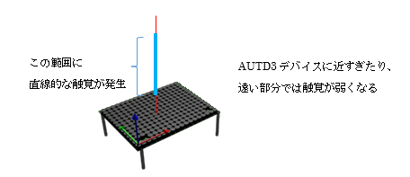

# 5.5 ベッセルビームサンプル(Sample04_bessel.rs)
## 動作概要

このサンプルは、AUTD3デバイスにてベッセルビームを発生させ、
一か所の焦点ではなく直線的な範囲の触覚を発生させます。




コンソールより下記コマンドを入力することで実行できます。

``` sh
$ cargo new --bin sample04					                プロジェクト作成
$ cd sample04							                    プロジェクトフォルダに移動
$ cp ~/Desktop/RustSample/Sample04_bessel.rs src/main.rs	サンプルコードのコピー
$ cargo add autd3 --offline					                autd3ライブラリ追加
$ cargo add autd3-link-ethercrab --offline			        ethercrabライブラリ追加
$ cargo build							                    ビルド
$ sudo ./target/debug/sample04					            実行
```

Enterキーを押すと、終了します。


---
<br>

## コード説明
コード全体を下記に示します。

``` rust
// AUTD3ライブラリの使用宣言
use autd3::prelude::*;

// EtherCrabライブラリの使用宣言
use autd3_link_ethercrab::{EtherCrab, EtherCrabOption};

// ------------------------------------------------------------
// メイン関数
fn main() ->Result<(), Box<dyn std::error::Error>> {

    println!( "<ベッセルビームデモ>" );

    // デバイスへの接続
    println!( "デバイス接続" );
    let devices = [AUTD3 {
            pos: Point3::origin(),
            rot: UnitQuaternion::identity(),
        }];
    let link = EtherCrab::new(
            |idx, status| {
                eprintln!( "Device[{}]: {}", idx, status );
            },
            EtherCrabOption::default()
        ); 
    let mut autd = Controller::open( devices, link )?;

    // 可聴音を抑えるための指示
    autd.send( Silencer::default() )?;

    // ベッセルビームの位相制御指示を生成
    let g = Bessel {
                apex: autd.center(),
                dir: UnitVector3::new_normalize( Vector3::new(0.0, 0.5, 1.0) ),
                theta: 13.0 / 180.0 * std::f32::consts::PI * rad,
                option: BesselOption {
                    intensity: Intensity::MAX, 
                    phase_offset: Phase::ZERO,
                }
            };

    // Sin波形の変調制御指示を生成
    let m = Sine {
                freq: 150 * Hz,
                option: SineOption::default()
            };

    // 位相制御と変調制御を送信(動作開始)
    println!( "動作開始" );
    autd.send( (m, g) )?;

    // キー入力待ち(終了指示待ち)
    let mut _s = String::new();
    println!( "Enterキー入力で終了" );
    std::io::stdin().read_line( &mut _s )?;

    // デバイスとの接続終了
    autd.close()?;

    // 終了
    Ok( () )
}
```

<br>

コードの詳細について説明します。

可聴音を抑える為の指示部分までと最後の待機/切断処理は、「単一焦点サンプル」とほぼ同様のため
「単一焦点サンプル」を参照願います。


<br>

``` rust
    // ベッセルビームの位相制御指示を生成
    let g = Bessel {
                apex: autd.center(),
                dir: UnitVector3::new_normalize( Vector3::new(0.0, 0.0, 1.0) ),
                theta: 13.0 / 180.0 * std::f32::consts::PI * rad,
                option: BesselOption {
                    intensity: Intensity::MAX, 
                    phase_offset: Phase::ZERO,
                }

    // Sin波形の変調制御指示を生成
    let m = Sine {
                freq: 150 * Hz,
                option: SineOption::default()
            };

    // 位相制御と変調制御を送信(動作開始)
    println!( "動作開始" );
    autd.send( (m, g) )?;
```

上記でベッセルビームを発生させる位相制御とAM変調制御を定義し送信しています。

ベッセルビームの位相制御は、ビームを生成する仮想円錐の頂点(apex)とビームの方向(direction)、  
及び、ビームに垂直な面と仮想円錐側面との角度(theta)を指定して定義します。


参考：https://shinolab.github.io/autd3-doc/jp/Users_Manual/API/gain/bessel.html

変調制御は単焦点サンプルと同じ「正弦波:Sine」を指定しています。
