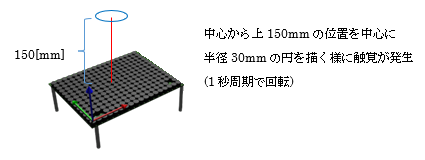
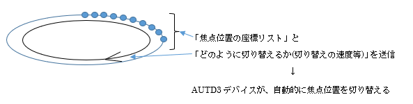

## 5.6 STMサンプル(Sample05_stm.rs)

## 動作概要
このサンプルは、Spatio-Temporal Modulation:時空間変調(STM)をもちいて、
時間とともに変化する焦点を発生させます。



コンソールより下記コマンドを入力することで実行できます。

``` sh
$ cargo new --bin sample01					                プロジェクト作成
$ cd sample01							                    プロジェクトフォルダに移動
$ cp ~/Desktop/RustSample/Sample01_single.rs src/main.rs	サンプルコードのコピー
$ cargo add autd3 --offline					                autd3ライブラリ追加
$ cargo add autd3-link-ethercrab --offline			        ethercrabライブラリ追加
$ cargo build							                    ビルド
$ sudo ./target/debug/sample01					            実行
```

Enterキーを押すと、終了します。

サンプルは単焦点サンプルと同様に位相制御等を送信後はキー入力があるまでプログラムは待機状態となりますが、焦点移動サンプルの様に触覚の移動が繰り返されます。

ライブラリでは下記のSTM機能を提供しています。  
　　FociSTM		：８つまでの焦点を制御するSTM  
　　GainSTM　	：任意のGainを組み合わせて制御するSTM  
本サンプルではFociSTMを使用します。

FociSTMでは、「焦点の発生座標リスト」と「焦点の切り替え周期」を決定するパラメタを
AUTD3デバイスに送信し、AUTD3デバイス内で自動的に焦点座標を切り替えさせることで
焦点の動きを実現します。



本サンプルでは、「200個の焦点座標リスト」と「1Hz」のパラメタを送信していますので、
円を描く200点の焦点が1秒周期で回転するような触覚が発生します。

---
<br>

## コード説明

コード全体を下記に示します。

``` rust
// ライブラリの使用宣言
use autd3::prelude::*;
use autd3_link_ethercrab::{EtherCrab, EtherCrabOption};

// ------------------------------------------------------------
// メイン関数
fn main() ->Result<(), Box<dyn std::error::Error>> {

    println!( "<時空間変調デモ>" );

    // デバイスへの接続
    println!( "デバイス接続" );
    let devices = [AUTD3 {
            pos: Point3::origin(),
            rot: UnitQuaternion::identity(),
        }];
    let link = EtherCrab::new(
            |idx, status| {
                eprintln!( "Device[{}]: {}", idx, status );
            },
            EtherCrabOption::default()
        ); 
    let mut autd = Controller::open( devices, link )?;

    // 可聴音を抑えるための指示
    autd.send( Silencer::default() )?;

    // 動作指定
    let center = autd.center() + Vector3::new( 0.0, 0.0, 150.0 * mm );
    let radius = 30.0 * mm;
    let reso = 200;
    let stm = FociSTM {
        foci: (0..reso)
            .map( |i| {
                let theta = 2.0 * PI * i as f32 / reso as f32;
                let p = radius * Vector3::new( theta.cos(), theta.sin(), 0.0 );
                center + p
            })
            .collect::<Vec<_>>(),
        config: 1.0 * Hz
    };

    // 変調なしの変調制御指示を生成
    let m = Static { intensity: 0xFF };
    
    // 位相制御と変調制御を送信(動作開始)
    println!( "動作開始" );
    autd.send( (m, stm) )?;

    // キー入力待ち(終了指示待ち)
    let mut _s = String::new();
    println!( "Enterキー入力で終了" );
    std::io::stdin().read_line( &mut _s )?;

    // デバイスとの接続終了
    autd.close()?;

    // 終了
    Ok( () )
}
```

コードの詳細について説明します。

可聴音を抑える為の指示部分までと最後の待機/切断処理は、  
「単一焦点サンプル」とほぼ同様のため「単一焦点サンプル」を参照願います。

<br>

``` rust
    // 動作指定
    let center = autd.center() + Vector3::new( 0.0, 0.0, 150.0 * mm );
    let radius = 30.0 * mm;
    let reso = 200;
    let stm = FociSTM {
        foci: (0..reso)
            .map( |i| {
                let theta = 2.0 * PI * i as f32 / reso as f32;
                let p = radius * Vector3::new( theta.cos(), theta.sin(), 0.0 );
                center + p
            })
            .collect::<Vec<_>>(),
        config: 1.0 * Hz
    };
```

上記では中心位置(autd.center())を中心とした半径:radius(30.0)[mm]の  
円の円周上の200点の座標リスト(foci)と１Hzで繰り返す周期設定(config)を指定し、  
FociSTM(stm)を定義しています。

``` rust
    // 変調なしの変調制御指示を生成
    let m = Static { intensity: 0xFF };
```
本サンプルでは変調制御としてStaticを使用しています。  

他サンプルの正弦波Sineと違いAM変調が付与されませんが、  
STMにより焦点が次々と変化するため触感を感じられます。  
（正弦波AM変調を付与した場合より、より小さな触感が得られます）
