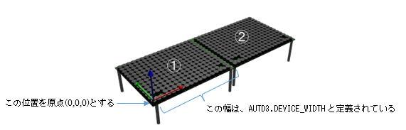

## 4.3 AUTD3クラス

### 概要
接続されている個々のAUTD3デバイス情報を管理する。  
AUTD3デバイスの物理的な設置状態に合わせて定義し、接続時に指定する。

---

### 作成
``` rust
impl<R> AUTD3<R>
where R: Into<Unit<Quaternion<f32>>> + Debug,
pub fn new(pos: OPoint<f32, Const<3>>, rot: R) -> AUTD3<R>
```
| 引数| 内容 |
| --- | ---  |
| pos | AUTD3ボードの位置(座標を[x,y,z]で指定) |
| rot | AUTD3ボードの向き(ベクトルを[x,y,z,w]で指定) |

横に2台並べて設置する場合は、下記の様な定義となる。

``` rust
① AUTD3{ pos: UnitQuaternion::identity(), rot: UnitQuaternion::identity() }
② AUTD3{ pos: Point3::new(AUTD3::DEVICE_WIDTH, 0., 0.), rot: UnitQuaternion::identity() } 

```

下記の様に立体的に配置する場合、下記の様な定義となる。

``` rust
① AUTD3{ pos: UnitQuaternion::identity(), rot: UnitQuaternion::identity()}
② AUTD3{ pos: Point3::new( 0., 0., AUTD3.DEVICE_WIDTH ], 
            rot: EulerAngle::ZYZ(0. * rad, PI/2.0 * rad, 0. * rad).into()}
```

Controllerクラスのopenメソッドの第1引数に上記のリストを指定する。

参考：https://shinolab.github.io/autd3-doc/jp/Users_Manual/tutorial/multiple.html

