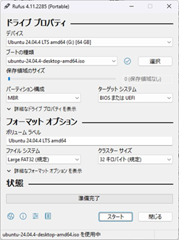
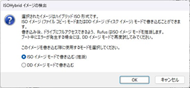
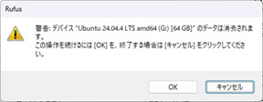

## 3.2 OSインストール用USBメディア

### メディア作成ツールのダウンロード  
下記よりメディア作成ツール(Rufus)を作業用PC内にダウンロードします。  
　　[Rufus Portable版 ver 4.11  (正式配布先)](https://github.com/pbatard/rufus/releases/download/v4.11/rufus-4.11p.exe)  
　　[Rufus Portable版 ver 4.11  (コピー)](https://github.com/sld-nb-haptic/dev-haptic/blob/main/Download/rufus-4.11p.exe)

下記ファイルがダウンロードされます。（2MBほどです）  
　　rufus-4.11p.exe  

上記ファイルはポータブル版となっており、PCへのインストールは必要ありません。  

---

### Linuxイメージファイルのダウンロード
下記よりUbuntuのインストール用イメージを作業用PC内にダウンロードします。  
　[ubuntu-24.04.4-desktop-amd64.iso](https://ftp.riken.jp/Linux/ubuntu-releases/24.04/ubuntu-24.04.4-desktop-amd64.iso)  
   
  　上記リンクが切れている場合、下記等より「ubuntu-24.04.4-desktop-amd64.iso」をダウンロードしてください。  
　　　　[https://ftp.riken.jp/Linux/ubuntu-releases/24.04/](https://ftp.riken.jp/Linux/ubuntu-releases/24.04/)  
　　　　[https://ubuntu.com/download/desktop](https://ubuntu.com/download/desktop)

下記ファイルがダウンロードされます。（6.5GB程あります）  
　ubuntu-24.04.4-desktop-amd64.iso  

---

### OSインストール用USBメディアの作成  
下記手順でOSインストール用USBメディアを作成します。  
（下記はUSBメディア作成用ツールRufusの画面です)  

  

① OSインストール用USBメディアをPCにセット  
USB内部のデータは全て削除されます。  

② メディア作成ツール(Rufus)を起動  
ダウンロードしたrufus-4.11p.exeをエクスプローラ等から起動してください。  

③ 「デバイス」欄でUSBメディアを選択  

④ 「ブートの種類」の「選択」ボタンをクリックし、  
ダウンロードしたLinuxイメージファイル(ubuntu-24.04.4-desktop-amd64.iso)を選択  
「パーティション構成」欄は「MBR」、  
「ターゲットシステム」欄は「BIOSまたはUEFI」を選択  

⑤ 「スタート」ボタンをクリック  

⑥ 「ISOHybridイメージの検出」ダイアログでは「ISOイメージモードで書き込む(推奨)」を選択し、  
「OK」をクリック  
  

⑦ 「データ消去警告」ダイアログでは、USBを確認して、「OK」をクリック  
  

⑧ 完了後、「閉じる」をクリック

