# 5 OSインストール

## インストール
以下の手順にてOS(Ubuntu)のインストールを行います。  

---

① OSインストール用USBメディアをPCにセット
　USBポートに「OSインストール用USBメディア」を挿入します。  

---

② USBメディアから起動  
　下記の手順でUSBメディアからの起動を行います。  

②-1 ADLINKロゴが表示されているタイミングで、F12キーを押します。  
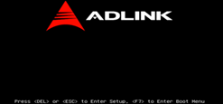

②-2 Iブートメニューから「UEFI:VendorCoProductCode 2.00」を選択し、Enterを押します。  
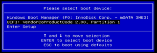

---
　　　  
③ Grubメニュー選択
OSインストール用USBメディアから起動した場合、下記のGrubメニューが表示されます。  
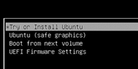

Grubメニューから「Try or Install Ubuntu」を選択肢、Enterを押します。  
暫く待つとUbuntuのグラフィカルインストール画面が表示されます。

---

④ 言語選択  
リスト(スクロール可能)から「日本語」を選択します。  
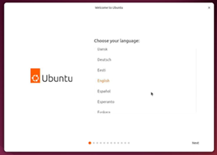 → 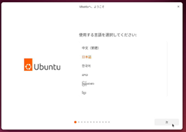  

リストの「日本語」項目を選択すると画面表示が日本ととなります。  
日本語になった状態で「次」をクリックします。  
（キーボードで選択した場合は日本語にならない場合があります。マウスで選択してください）  

---

⑤ アクセシビリティ選択  
特に必要がなければ「次」をクリックします。  
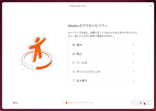  

---

⑥	キーボードレイアウト選択  
リストから「日本語」を選択し、「次」をクリックします。  
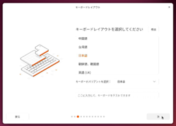  

---
⑦ インターネットの接続方法選択
「今はインターネットに接続しない」が選択されていることを確認し、「次」をクリックします。  
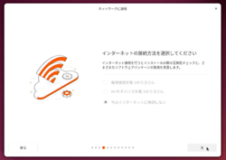
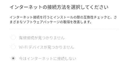

> [!CAUTION]  
キットPCはインターネットに接続しないでください。  
Ubuntuのアップデート機能によりライブラリ等が更新され、
動作不良を起こす可能性があります。

---

⑧ 使用方法選択  
「Ubuntuをインストール」を選択肢、「次」をクリックします。  
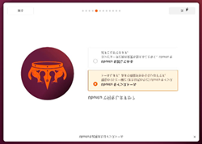
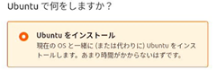

---

⑨ インストール方式の選択  
「対話式インストール」を選択し、「次」をクリックします。  
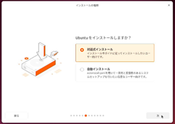
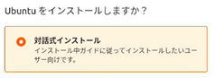

---

⑩ インストールアプリの選択  
「既定の選択」を選択肢、「次」をクリックします。  
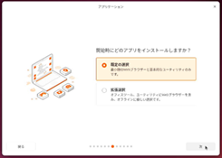
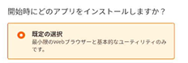

---

⑪ プロプライエタリなソフトウェアの選択  
「グラフィックスとWi-Fi機器用のサードパーティ製ソフトウェアをインストールする」を選択し、  
「次」をクリックします。  
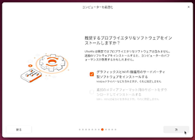
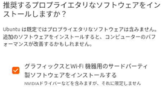

---
 
⑫ インストール先の選択  
「ディスクを削除してUbuntuをインストールする」を選択し、「次」をクリックします。  
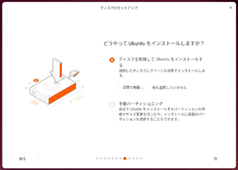
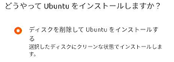

HDDの状態によっては（既にOSがインストールされている場合や、他のOSが入っている場合）、  
他の選択肢が表示される場合もあります。  
（本書では搭載されたHDDにUbuntuのみをインストールことを前提としてます）  

---

⑬ アカウントの設定  
下記を入力し、「次」をクリックします。  
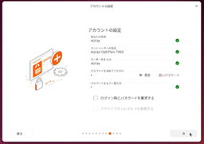
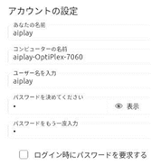  
　　あなたの名前：<u>aiplay</u>  
　　コンピュータの名前：<u>aiplay-OptiPlex-7060</u>    (自動的に生成される名前)  
　　ユーザ名：<u>aiplay</u>  
　　パスワード：<u>0</u>  

上記は初期ユーザ/パスワードとなります。  
必要に応じて変更してください。  

---

⑭ タイムゾーンの選択  
日本を含むタイムゾーンを選択し、「次」をクリックします。  
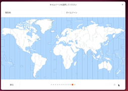
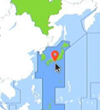  

現在値：<u>Tokyo</u>  
タイムゾーン：<u>Asia/Tokyo</u>  

---

⑮ インストール最終確認  
選択内容が表示されます。  
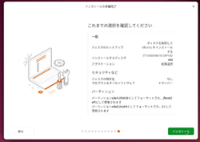  

「次」をクリックすると、インストールが開始されます。  
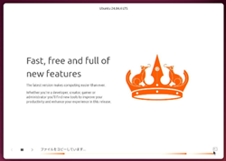  

---

⑯ 完了待ち  
下記の様な表示となればインストールは完了です。  
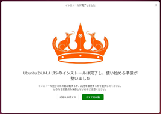  

「今すぐ再起動」をクリックします。  

インストール時に下記の様なダイアログが表示される場合があります。  
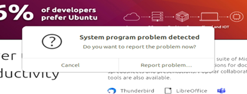  

この問題はインストーラの既知の問題の可能性が高く、  
インストールが継続される場合は無視しても問題はありません。  
（Cancelで閉じることができます）  

---

⑰ 再起動  
再起動が始まると下記の様な表示となります。  
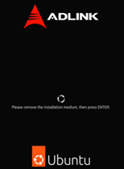
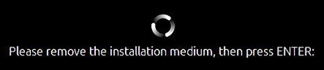  
OSインストール用USBメディアを外しEnterを押します。  

---

## インストール後の最終設定

Ubuntuを初回起動時(インストール完了後の再起動時)は、有料オプションへの案内等が表示されます。  
（どのような言語を選択しても英語で表示されます）  
下記の手順でインストールを完了させます。  

① Welcome画面  
右上の「Next」をクリックします。  
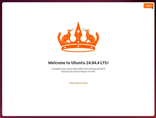  

② Ubuntu Pro(有料オプション)の選択  
「skip for now」を選択し、右上の「skip」をクリックします。  
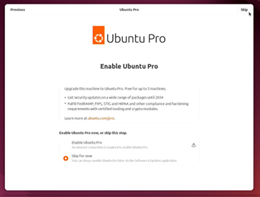
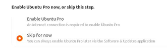

③ 解析情報送信の選択  
異常発生時の情報送信は行わないため「No, don't share system data」を選択し、  
「Next」をクリックします。  
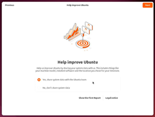
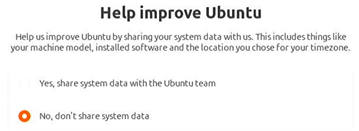

④ 完了  
「Finish」をクリックすると、OSインストールは完了です。  
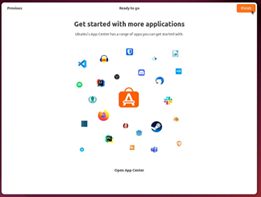
