# 6. サンプル環境セットアップ

下記手順でサンプルが動作する環境を構築します。

---

① 環境セットアップ用USBメディアをセットする  
USBメディアが認識されると、画面左端に「USBメディア」のアイコンが表示されます。  
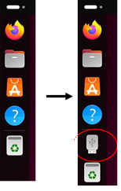

---

② USBメディアを開く  
USBメディアアイコンをダブルクリックし、USB内のファイルを表示させます。  
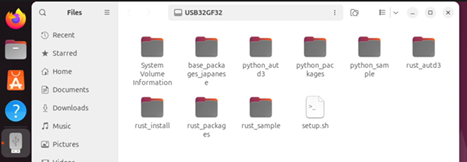
 
---

③ ターミナルを開く  
USBメディアウィンドウ内のアイコンがない箇所で、マウス右ボタンをクリックします。  
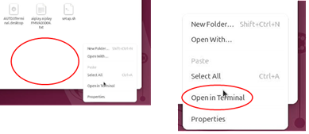

表示されるメニューから「Open Terminal」をクリックします。

---

④ ターミナルからセットアッププログラムを実行  
ターミナルに下記を入力し、Enterを押します。  
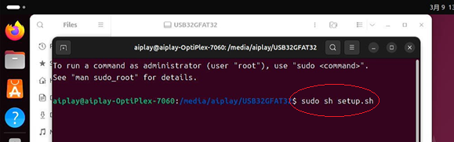  
```
　　sudo sh setup.sh
```

---

⑤ パスワード入力  
パスワードの入力が求められますので「0」を入力し、Enterを押します。  
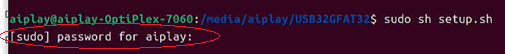

---

⑥ 実行確認  
セットアップを行うかの確認が表示されますので、「y」を入力しEnterを押します。  
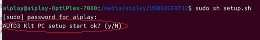

---

⑦ セットアップ完了待ち  
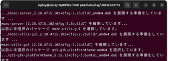  
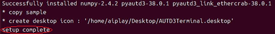  
セットアップが完了すると「```setup complete```」と表示され、  
画面右下にいくつかのアイコンが生成されます。  
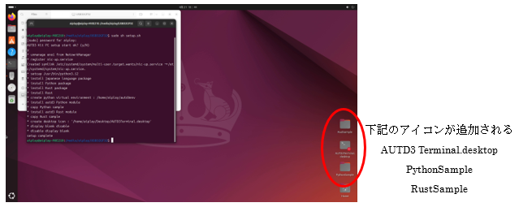  

---

⑧ アイコンの実行許可
セットアップ直後は上記のアイコン「AUTD3Terminal.desktop」に赤い×印が表示され、  
実行ができなくなっています。（セキュリティ上の制限）  
アイコン上で右クリックしメニューから「Allow Launching」をクリックします。  
アイコンの赤い×が消え、実行できるようになります。  
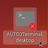　→　
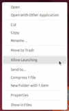　→　
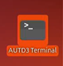

---

⑨ 再起動
セットアップ内容を有効化させるため、PCを再起動させます。  
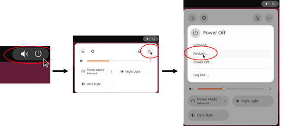  

画面右上の電源アイコンをクリック　→　  
表示されるメニューの電源アイコンをクリック　→　  
　「Power Off」メニューから「Restart」をクリックします。  

再起動後は「Power Off」メニュー等の表示が日本語となります。  

セットアップ完了後のでストップ画面  
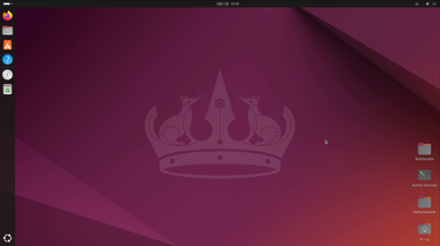  

