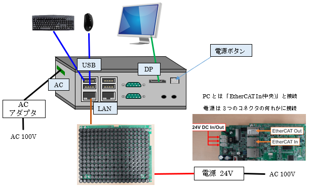

# 7. 動作確認
## 7.1 機器接続
下記の様に機器を接続します。  

モニタはDP(DisplayPort)に接続します。  
HDMIモニタに接続する場合は、別途変換コネクタ等をご用意願います。  

本体LAN1(左側)とAUTD3デバイスをLANケーブルで接続します。  
AUTD3ボード側は、３つあるLANポートの中央(EtherCAT In)に接続します。  

AUTD3ボードの電源は、３つあるポートの何れかに接続します。  
