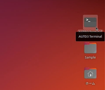
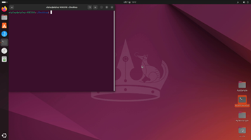
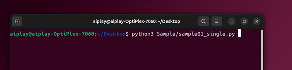
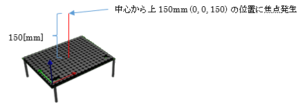
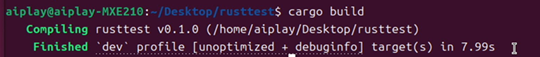
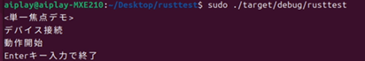

## 7.2 サンプルプログラム実行

### [Python環境]  
PCの電源を投入し、ディスクトップ画面が表示されましたら、  
以下の手順でサンプルプログラム(sample01_single.py)を実行し、動作を確認します。  

---

① デスクトップのアイコン「AUTD3 Terminal」をダブルクリックし、AUTD3動作用のターミナルを開きます。  
　→　


---

② ターミナル上で下記コマンドを入力し、Enterを押します。  
```
　python3 PythonSample/sample01_single.py
```
  

---

③ AUTD3デバイスの中央上15cmの場所で触覚が感じられるか確認します。  
  

---

④ ターミナル上でEnterを押し、動作を停止させます。  

--- 

⑤ Ubuntuを終了させ、電源を落とします。  

---
<br>
<br>
<br>

---

### [Rust環境]  
PCの電源を投入しディスクトップ画面が表示されたら、  
以下の手順でサンプルプログラム(sample01_single.rs)をビルド・実行し、動作を確認します。

---

① デスクトップのアイコン「AUTD3 Terminal」をダブルクリックし、AUTD3動作用のターミナルを開く。
(Pythonサンプルと同様)

---

② ターミナル上で下記コマンドを入力し、ビルドする。
``` sh
$ cargo new --bin rusttest
$ cd rusttest
$ cargo add autd3 --offline
$ cargo add autd3-link-ehtercrab --offline
$ cp ~/Desktop/RustSample/Sample01_single.rs src/main.rs
$ cargo build
```

下記の様な出力となれば、ビルドは成功。  
 

---

③ 続けて、下記コマンドを入力し、実行する。
```
$ sudo ./target/debug/rusttest
(rootのパス入力が要求された場合、0(デフォルトパスワード)を入力)
```

---

④ 下記の様な出力あり、AUTD3デバイスの中央上15cmの場所で触覚が感じられるか確認する。(Pythonサンプルと同様)

 
---

⑤ ターミナル上でEnterを押し、動作を停止させる。
